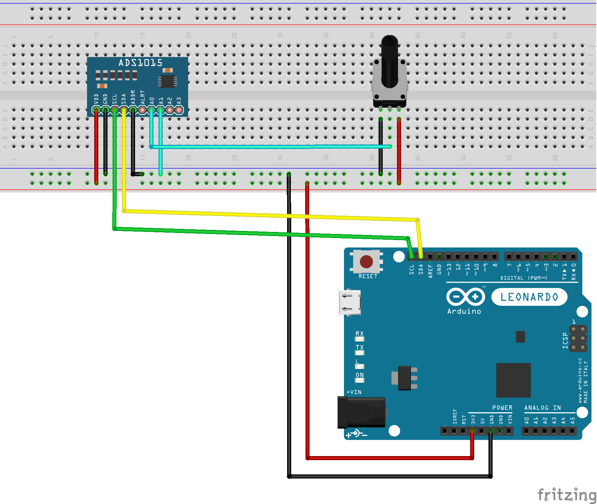
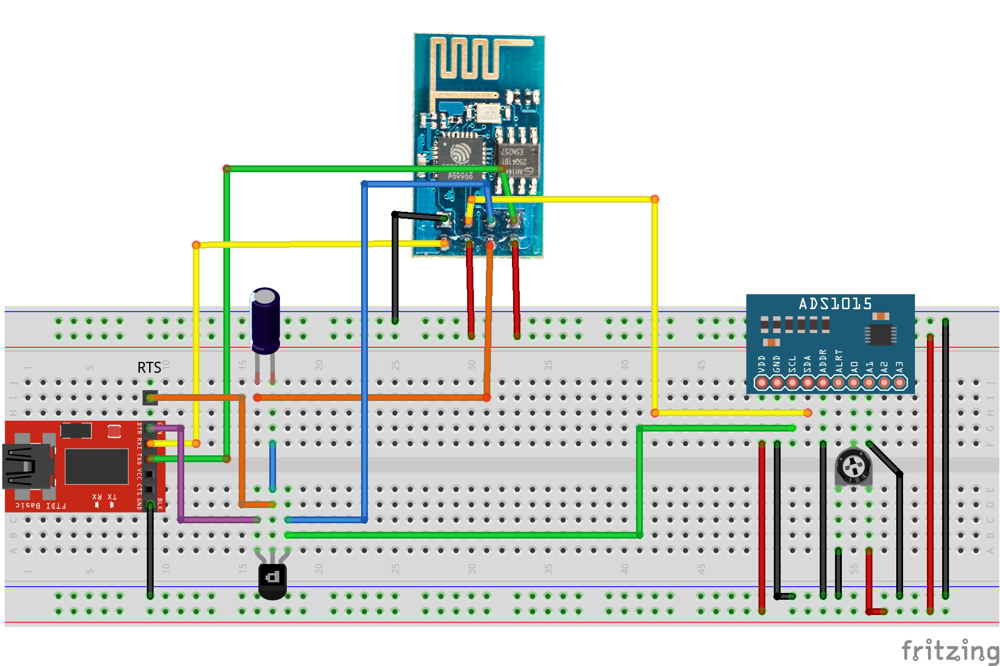

# Fast Read ADS1015
 Highest sampling speed possible with ADS1015 reading 2 ADC pins (AIN0 and AIN1)  

 
 Wiring  +-1 ms with arduino leonardo (read_adc.ino)
 

 Wiring  +-0.5 ms with esp8266 (read_adc_max_resolution.ino)
 
 
links:
https://learn.adafruit.com/adafruit-4-channel-adc-breakouts/signal-connections
https://cdn-shop.adafruit.com/datasheets/ads1015.pdf
https://github.com/rpsreal/Adafruit_ADS1X15/blob/master/Adafruit_ADS1015.h
https://www.instructables.com/id/ESP8266-as-Arduino/
https://arduinodiy.wordpress.com/2016/10/11/using-the-4-pins-of-the-esp8266-01/
https://www.instructables.com/id/FTDI-ESP8266-Definitive-Wiring/

 Developed by Rui Silva, Porto, Portugal
